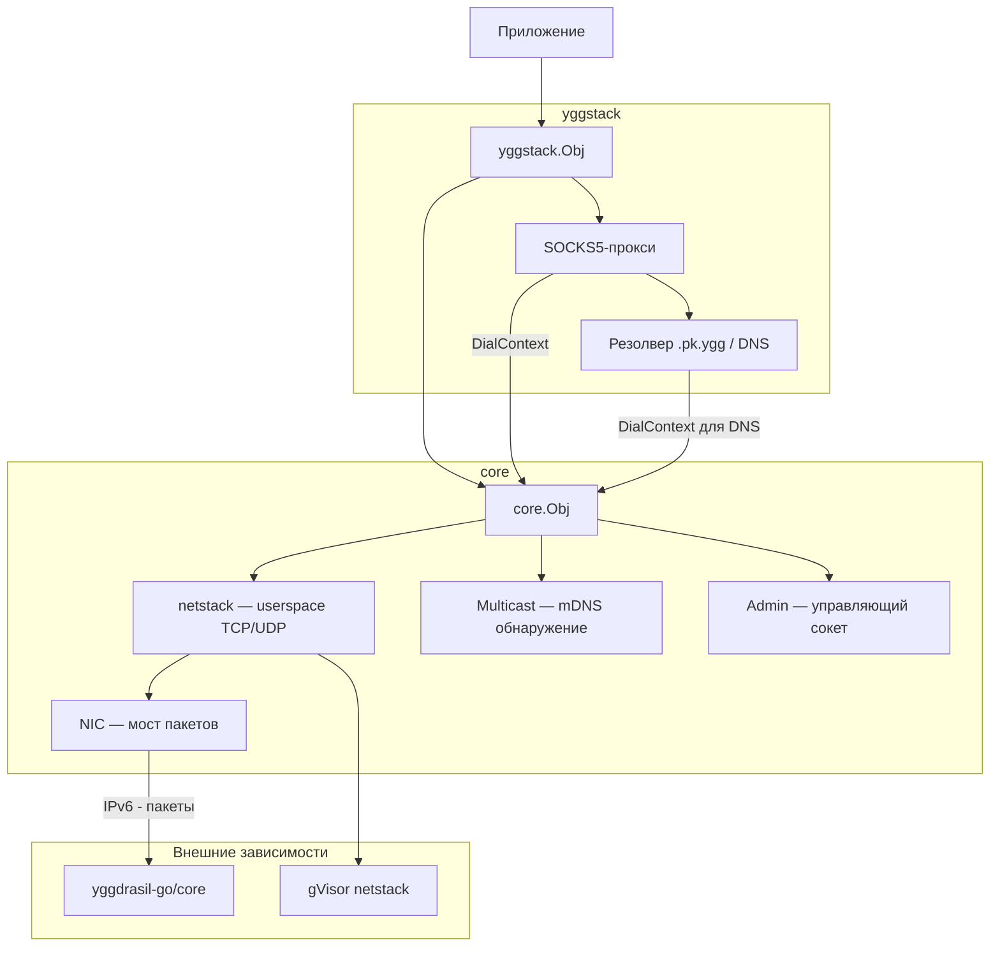
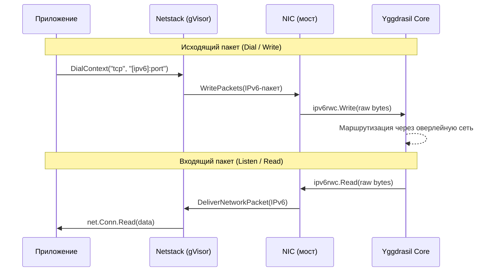
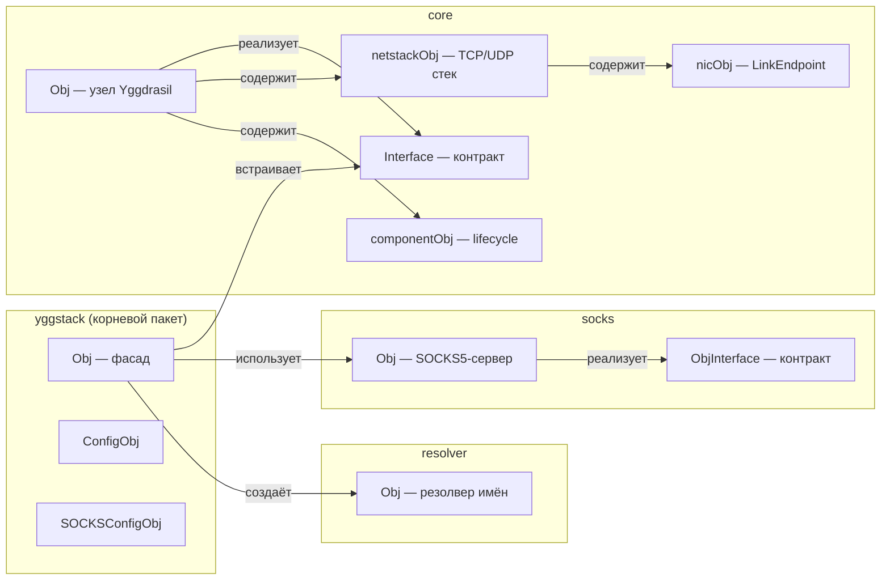
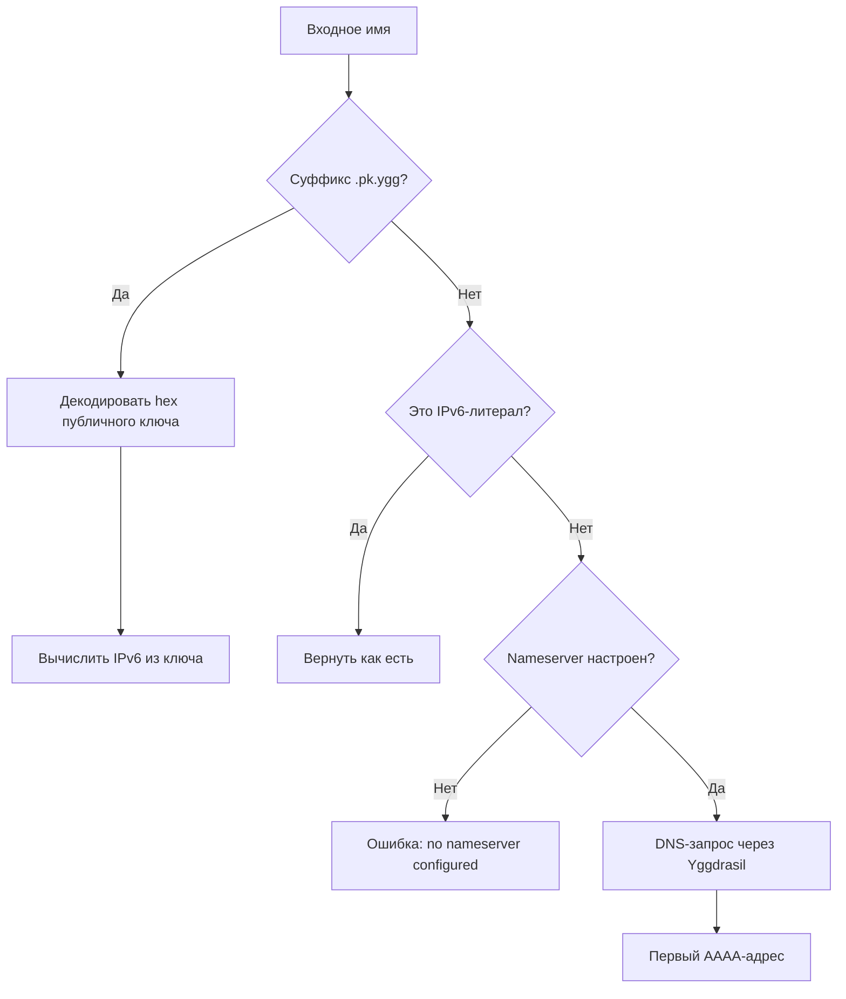
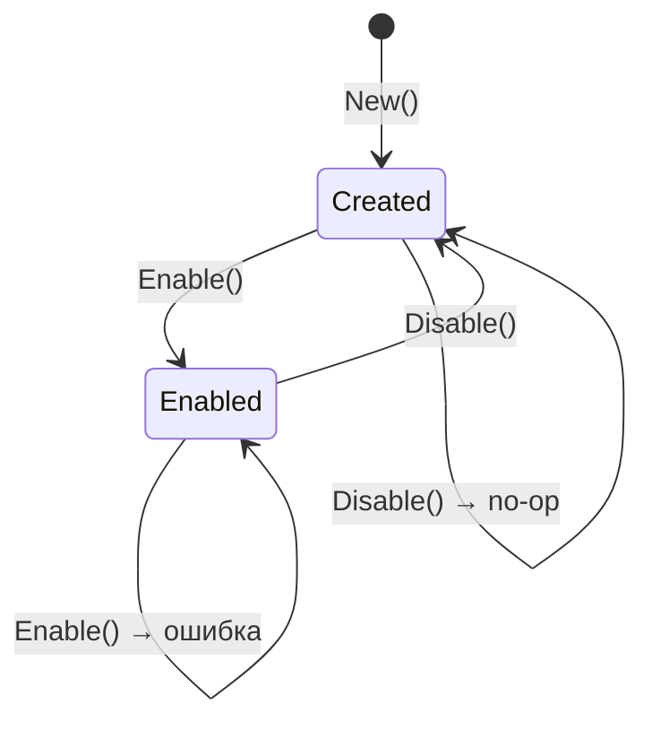
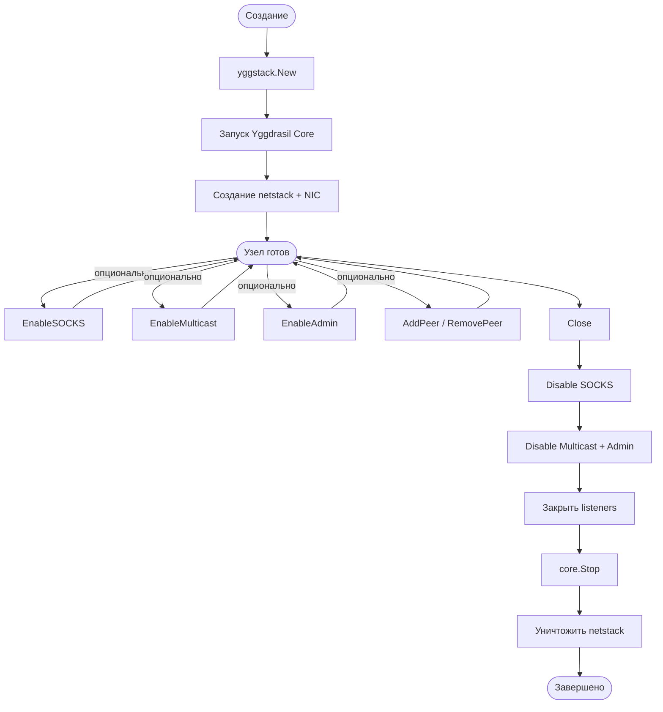

# yggstack

Go-библиотека для встраивания узла Yggdrasil в приложения. Предоставляет стандартные Go-сетевые примитивы (
`DialContext`, `Listen`, `ListenPacket`) поверх userspace TCP/IP стека (gVisor netstack), без необходимости создавать
TUN-интерфейс или получать root-права.

## Архитектура



## Путь пакета

Как данные проходят через стек — от приложения до Yggdrasil-сети и обратно:



## Структура модуля



## Пакеты

### `yggstack` (корневой)

Фасад для встраивания. Объединяет ядро, SOCKS-прокси и резолвер в одну точку входа.

| Тип              | Назначение                                                              |
|------------------|-------------------------------------------------------------------------|
| `Obj`            | Узел с полным набором возможностей: сетевые методы + SOCKS + управление |
| `ConfigObj`      | Контекст, конфиг Yggdrasil, логгер, таймаут                             |
| `SOCKSConfigObj` | Адрес прокси, DNS-сервер, verbose, лимит соединений                     |

### `core`

Ядро — узел Yggdrasil с userspace сетевым стеком.

| Тип            | Назначение                                                                   |
|----------------|------------------------------------------------------------------------------|
| `Obj`          | Узел: DialContext, Listen, ListenPacket, управление пирами, multicast, admin |
| `Interface`    | Публичный контракт — всё, что нужно внешнему коду                            |
| `netstackObj`  | gVisor TCP/UDP/ICMP стек                                                     |
| `nicObj`       | Мост между gVisor и Yggdrasil на уровне IPv6-пакетов                         |
| `componentObj` | Обобщённый Enable/Disable lifecycle для multicast и admin                    |

### `resolver`

Резолвер имён с тремя стратегиями:



### `socks`

SOCKS5-прокси поверх Yggdrasil. Поддерживает TCP и Unix-сокеты.



## Жизненный цикл



## Быстрый старт

```go
package main

import (
	"context"
	"fmt"
	"net/http"

	"github.com/yggdrasil-network/yggstack/temp-new"
)

func main() {
	// Создаём узел (случайные ключи)
	node, err := yggstack.New(yggstack.ConfigObj{
		Ctx: context.Background(),
	})
	if err != nil {
		panic(err)
	}
	defer node.Close()

	fmt.Println("Адрес:", node.Address())

	// HTTP-клиент через Yggdrasil
	client := &http.Client{
		Transport: &http.Transport{
			DialContext: node.DialContext,
		},
	}

	// Запрос к Yggdrasil-узлу
	resp, err := client.Get("http://[200:abcd::1]:8080/")
	if err != nil {
		panic(err)
	}
	defer resp.Body.Close()
}
```

## Запуск с SOCKS5-прокси

```go
// Включаем SOCKS5
err = node.EnableSOCKS(yggstack.SOCKSConfigObj{
Addr:           "127.0.0.1:1080",
Nameserver:     "[200:abcd::1]:53", // DNS через Yggdrasil
Verbose:        true,
MaxConnections: 128, // 0 = без ограничений
})
if err != nil {
panic(err)
}
defer node.DisableSOCKS()

// Теперь curl --proxy socks5h://127.0.0.1:1080 http://example.pk.ygg/
```

## TCP-сервер в сети Yggdrasil

```go
ln, err := node.Listen("tcp", ":8080")
if err != nil {
panic(err)
}
defer ln.Close()

fmt.Printf("Слушаю на http://[%s]:8080/\n", node.Address())
http.Serve(ln, handler)
```
